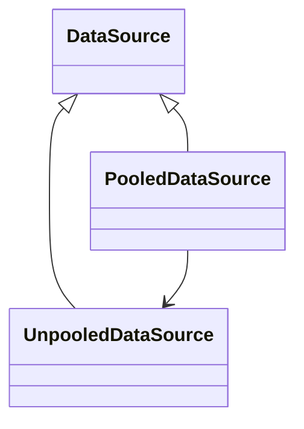

# Mybatis框架快速上手

Mybatis是一款优秀的持久层框架，它是用Java语言编写的，它封装了JDBC操作的很多细节，使用了ORM思想实现了结果集的封装，使得开发者只需要关注SQL语句本身，而无需关注注册驱动、创建连接等繁杂过程。

> ORM是啥：
> 	Object Relational Mapping 对象关系映射（就是把数据库表和实体类及实体类的属性对应起来让我们可以操作实体类就实现操作数据库表。）

## Mybatis的环境搭建(Maven)
​	第一步：创建maven工程并导入坐标
​	第二步：创建实体类和Dao接口
​	第三步：创建Mybatis的主配置文件——MybatisConf.xml(名字自己起)
​	第四步：创建映射配置文件——IIMapper.xml(名字自己起)

### Mybatis和mysql-connector等常用的坐标

```xml
<!--Mybatis-->
<dependency>
   	<groupId>org.Mybatis</groupId>
   	<artifactId>Mybatis</artifactId>
   	<version>3.5.5</version>
</dependency>
<!--Mysql连接驱动-->
<dependency>
    <groupId>mysql</groupId>
    <artifactId>mysql-connector-java</artifactId>
    <version>5.1.6</version>
    <scope>runtime</scope>
</dependency>
<!--单元测试-->
<dependency>
    <groupId>junit</groupId>
    <artifactId>junit</artifactId>
    <version>4.11</version>
    <scope>test</scope>
</dependency>
<!--如果使用的是mysql8.0之后的版本，则应该导入一下的坐标-->
<dependency>
    <groupId>mysql</groupId>
    <artifactId>mysql-connector-java</artifactId>
    <version>8.0.11</version>
    <scope>runtime</scope>
</dependency>
```

### MybatisConf.xml的约束

> 在xml技术中，可以使用约束来规定一个文档的书写规范，来保证文档中数据的规范性和安全性。

```xml-dtd
<?xml version="1.0" encoding="UTF-8"?>
<!DOCTYPE configuration  
  PUBLIC "-//Mybatis.org//DTD Config 3.0//EN"  
  "http://Mybatis.org/dtd/Mybatis-3-config.dtd">
```

### IIMapper.xml的约束

```xml-dtd
<?xml version="1.0" encoding="UTF-8"?>
<!DOCTYPE mapper  
  PUBLIC "-//Mybatis.org//DTD Mapper 3.0//EN"  
  "http://Mybatis.org/dtd/Mybatis-3-mapper.dtd">
```
### MybatisConf.xml模板

```xml
<?xml version="1.0" encoding="UTF-8"?>
<!DOCTYPE configuration  
  PUBLIC "-//Mybatis.org//DTD Config 3.0//EN"  
  "http://Mybatis.org/dtd/Mybatis-3-config.dtd">
  <!-- Mybatis 主配置文件 -->
  <configuration>
  <!-- 配置环境 -->
	<environments default="mysql">
	<!-- 配置mysql环境 -->
		<environment id="mysql">
            <!-- 配置事务的类型 -->
            <transactionManager type="JDBC"></transactionManager>
            <!-- 配置数据源，也叫连接池 -->
            <dataSource type="POOLED">
                <property name="driver" value="com.mysql.jdbc.Driver"/>
                <property name="url" value="jdbc:mysql://localhost:3306/使用的数据库名"/>
                <property name="username" value="用户名"/>
                <property name="password" value="密码"/>
            </dataSource>
		</environment>
	</environments>
	
<!-- 指定映射配置文件的位置 -->
  <mappers>
    <mapper resource="top/aerlee/dao/IIMapper.xml"/></mappers>
  </configuration>
  
  <!--如果使用注解的方式，则mappers部分是下面这样-->
  <mappers>
	  <mapper class="top.aerlee.dao.IDao"/>
  </mappers>
```

### IIMapper.xml的模板

```xml
<?xml version="1.0" encoding="UTF-8"?>
<!DOCTYPE mapper  
  PUBLIC "-//Mybatis.org//DTD Mapper 3.0//EN"  
  "http://Mybatis.org/dtd/Mybatis-3-mapper.dtd">
 <mapper namespace="top.aerlee.dao.IDao">
     <!--配置sql语句的标签id属性必须和持久层接口中方法的名称一致-->
     <select id="showAll" resultType="top.aerlee.domain.Girl">
        select * from 数据库表;
     </select>
 </mapper>
```


### 环境搭建的注意事项
**I:** IIMapper.xml是配置结果映射和SQL语句等相关内容的配置文件，可以根据需要来命名。

**II:** 在idea中创建目录跟创建包是不一样的，创建包时使用“.”做分隔可以创建三级目录结构，而创建目录时如果使用“.”做分隔指挥创建成一个一级目录。
    <u>包(package)在创建时：top.aerlee.dao是三级目录结构</u>
    <u>目录(directory)在创建时：top.aerlee.dao是一级目录结果</u>

**III:** Mybatis的映射配置文件位置必须和dao接口的包结构相同。
    比如，IIMapper.xml是IDao.java的映射配置文件，IDao.java放置在`main.java.top.aerlee.dao`包下，那么IIMapper.xml文件必须放置在`main.resources.top.aerlee.dao`包下。

**IV：**映射配置文件的mapper标签namespace属性的取值必须是dao接口的全限定类名。

**V：**映射配置文件的操作配置（select标签等），id属性的取值必须是dao接口的方法名

***在开发中，当我们遵从了上面的III，IV，V点之后，我们就无须再写dao的实现类，而是使用代理对象即可实现所有功能。***

## 快速入门

> 在这里，为了演示的效果，建有一个数据库：girlsinfo；数据库中有一张表：girls，girls表有三个属性，id，name，address三个列；一个实体类Girl的三个属性对应着girls表中的三列。一个查询接口：IDao.java，其中包含一个抽象方法 List\<Girl\> showAll();

```java
// 第一步：获取字节输入流，读取配置文件
InputStream in = Resources.getResourceAsStream("MybatisConf.xml");
// 第二步：创建SqlSessionFactory工厂对象
SqlSessionFactoryBuilder builder = new SqlSessionFactoryBuilder();
SqlSessionFactory factory = builder.build(in);
// 第三步：使用SqlSessionFactory对象生产一个SqlSession对象
SqlSession session = factory.openSession();
// 第四步：创建Dao接口的代理对象
IDao girldao = session.getMapper(IDao.class);
// 第五步：使用代理对象执行dao中的方法
List<Girl> girls = girldao.showAll();
// 第六步：释放资源
session.close();
in.close();
/* 
	一定要在映射配置中告知Mybatis要封装到哪个实体类中，即resultType属性
	配置的方式：指定实体类的全限定类名
*/
```

## 模糊查询的两种方式

第一种是在传入参数的时候加上%String%，如：` List<Girl> girls = GirlDao.searchByName("%李%");` 这种方式其实是使用了占位符的方式，也就是PrepareStatement。

```xml
<select id="searchByName" parameterType="String" resultType="top.aerlee.domain.Girl">
 	select * from girls where name like #{String}
 </select>
```

第二种是在sql语句中加上‘%’，在传入参数的时候，不需要再添加%，如：`List<Girl> girls = girldao.searchByName("李");`这种方式其实是使用了字符串拼接的方式，也就是Statement。

```xml
<select id="searchByName" parameterType="String" resultType="top.aerlee.domain.Girl">
 	<!--其中value是指定的，必须为value -->
 	select * from girls where name like '%${value}%'
 </select>
```

> 在这里，如果使用第二种方式，那么**${value}**中的value这个参数是不能自定义的，因为在源码中绑定了这个关键字为参数。但是一般情况下，从安全等角度来讲，我们还是使用第一种方式多一些。

## 映射配置文件IIMapper.xml中的一些标签及其属性

**resultType属性**：用于指定结果集的封装类型，它支持基本类型和实体类型，当使用实体类型且没有注册别名(**`typeAliases`**标签)时，要使用全限定类名来指定，而且同时，如果是使用实体类作为返回类型，则还有一个要求，实体类中的属性名称必须和查询语句中的列名保持一致，否则将无法实现结果的封装。(小提示： MySQL在Windows系统中不区分大小写）

>那么如果实体类跟查询语句中的列名不一致的时候如何处理？
1️⃣ 使用别名查询，例如：`SELECT id as girlID,name as girlName FROM girls;`  
(但这种方法仅适用于列比较少的情况，如果列多的话，那么SQL语句会显得很冗长。)
2️⃣ 定义resultMap标签，将实体类跟数据库表两者之间的映射关系定义在标签中，然后再在select标签中配置resultMap属性。

**resultMap属性**：用于定义要封装的实体类属性跟数据库表之间的映射关系。然后再在select标签中配置resultMap属性，替换原来的resultType即可。如：`<select id="showAll" resultMap="该Map的id"> SELECT * FROM girls</select>`

```xml
<resultMap type="要封装实体类的权限定类名" id="该Map的id，可以指定多个">
    <!-- id标签用于指定主键字段-->
	<id column="指定数据库列名" property="指定实体类属性名称"/>
    <!-- result标签用于指定非主键字段-->
    <result column="指定数据库列名1" property="指定实体类属性名称1"/>
    <result column="指定数据库列名2" property="指定实体类属性名称2"/>
</resultMap>
```

**parameterType属性**：用于指定传入参数的类型，可以是基本类型 、引用类型、实体类（pojo类）、也可以是实体类的包装类。当使用基本类型和String的时候，可以直接写类型名称或者`包名.类名`的形式，例如：`parameterType=”String”`或者`ParameterType=”java.lang.String”`，当使用实体类的时候，只能使用全限定类名。这是因为Mybatis框架事先已经把基本类型和一些常用的类型注册了别名，而实体类因为是我们自己定义的pojo类，所以没有注册别名，所以只能用全限定类名来找到它们了。

**SQL语句中的占位符“#{}”**：相当于原来JDBC中的 “?”，都是用于执行语句时替换实际的数据，具体的数据由#{}中的内容决定。

**#{}中内容的怎么写？**：如果是基本数据类型，就随便写，如果是是实体类属性，则写的是实体类对象中的属性名称，使用的是OGNL表达式，它是按照#{对象.对象}的方式来获取数据的。

>OGNL表达式：
Object Graphic Navigation Language
  对象	   图	         导航	        语言
它是通过对象的取值方法来获取数据。在写法上把get给省略了。
比如：我们获取用户的名称
类中的写法：user.getUsername();
OGNL表达式写法：user.username

**selectKey标签**

```xml
<insert id="saveinfo" parameterType="Girl">
	<selectKey keyProperty="id" keyColumn="id" order="AFTER" resultType="int">
		select last_insert_id()
	</selectKey>
	insert into girls(name, address) values(#(name), #{address})
</insert>
```

>它的作用是将SELECT LAST_INSERT_ID()的结果放入传入的Girl的主键（id）里面。
keyProperty属性：是对象中的主键的属性名，这里是Girl中的id，因为它跟数据库的主键对应。
order属性：有两个值，其中AFTER表示 `SELECT LAST_INSERT_ID() `在insert执行之后执行，多用于自增主键，得到的值其实是当前要插入的数据对应的主键。BEFORE表示 `SELECT LAST_INSERT_ID() `在insert执行之前执行，这样的话就拿不到当前要插入数据的主键了，这种适合那种主键不是自增的类型，得到的值其实是数据库原本记录的最后一个主键的值。
resultType属性：主键的数据类型。

## 基于自己编写实体类的方式开发Dao层

实际上，在使用Mybatis框架来开发Dao层的时候，我们更常用的是基于接口代理对象的方式，使用代理的方式去开发Dao层会非常的便捷，这在前面的内容里我们已经有所了解了，但是，Mybatis是支持自己写实现类去开发Dao层的，我们在这里做一个简单的了解。

### 编写接口的实现类

```java
// 之前的接口不变, 另外编写一个IDao接口的实现类
public class DaoImpl implements IDao{
    // 定义一个SqlSessionFactory
    private SqlSessionFactory factory;
    // 编写构造方法，在创建对象的时候传入一个SqlSessionFactory对象
    public DaoImpl(SqlSessionFactory factory){
        this.factory = factory;
    }
    // 重写接口中未实现的方法
    @Override
    public List<Girl> showAll(){
        // 通过SqlSessionFactory对象获取一个SqlSession对象
        SqlSession session = factory.openSession();
        // 调用SqlSession对象的selectList方法，传递方法
        List<Girl> girls = session.selectList("top.aerlee.dao.IDao.showAll");
        // 关闭SqlSession对象
        session.close();
        return girls;
    }
}
```

### 测试实现

```java
//1.获取字节输入流来读取配置文件
InputStream in = Resources.getResourceAsStream("MybatisConf.xml");
//2.创建构建者对象
SqlSessionFactoryBuilder builder = new SqlSessionFactoryBuilder();
//3.创建 SqlSession 工厂对象
SqlSessionFactory factory = builder.build(in);
//4.创建 Dao 接口的实现类
IDao girldao = new DaoImpl(factory);
// 其实区别就在这里，我们将Session的部分在接口实现类部分完成了，所以这里直接将SqlSessionFactory对象
// 传递给实现类，在实现类部分调用SqlSession的相关方法完成操作，其它部分是一样的。
```

## MybatisConf.xml中的一些配置标签

### **`<properties>`**标签——用来配置数据库的连接

其实就是将之前我们MybatisConf.xml中的数据库连接那部分提取了出来。有两种方法来配置properties属性。

第一种是直接将连接属性部分提取出来的方法：

```xml
<properties>
	<property name="driver" value="com.mysql.jdbc.Driver"/>
	<property name="url" value="jdbc:mysql://localhost:3306/数据库"/>
	<property name="username" value="用户名"/>
	<property name="password" value="密码"/>
</properties>
```

第二种是在ClassPath下定义连接配置文件database.properties

```
jdbc.driver=com.mysql.jdbc.Driver
jdbc.url=jdbc:mysql://localhost:3306/数据库(要连接的数据库)
jdbc.username=用户名
jdbc.password=密码
```

通过properties标签的两个属性：resource或url来指定properties配置文件的位置，如果使用resources属性时，要求配置文件必须在类路径下，一般放在src/main/resources目录下，如：

`<properties resource="database.properties"></properties>` 

如果使用url属性时，则要按照url要求来写。如：

`<properties url="file:///F:/IdeaProjects/YourProject/src/main/resources/database.properties"> </properties>`

当我们配置了properties标签，那么MybatisConf.xml中的dataSource连接部分就应该这样写：

```xml
<dataSource type="POOLED"> 
	<property name="driver" value="${jdbc.driver}"/>
	<property name="url" value="${jdbc.url}"/>
	<property name="username" value="${jdbc.username}"/>
	<property name="password" value="${jdbc.password}"/>
</dataSource>
```

### **`<typeAliases>`**标签——用来配置自定义类型别名

```xml
<typeAliases>
<!-- typeAlias子标签 对单个类型进行别名的定义 --> 
<typeAlias alias="girl" type="top.aerlee.domain.girl"/>
<!--package子标签，指定一个包，扫描整个包下面所有的类，将类名定义为别名，批量定义，不区分大小写--> 
<package name="top.aerlee.domain"/>
</typeAliases>
```

### **`<Mappers>`**标签——映射器

**`<mapper resource="">`**使用相对于类路径的资源，如：

`<mapper resource="top/aerlee/dao/IIMapper.xml">`

**`<mapper class="">`**使用mapper接口类路径资源，如：

`<mapper class="top.aerlee.dao.IDao">`

**`<mapper url=""/>`**使用url定义资源，如：

`<mapper url="file:///F:/IdeaProjects/YourProject/src/main/resources/IIMapper.xml"/>`

**`<package name=""/>`**指定包下面所有的映射接口，如：

`<package name="top.aerlee.dao.mapper"/>`

这种方法要求 mapper 接口的名称和 mapper 映射文件名称相同，且放在同一个目录中。

## 在Mybatis中使用连接池技术

在MybatisConf.xml配置文件中的\<dataSource\>标签中来配置数据库连接池。

|关键字|含义|
| -------- | ---------------------- |
| UNPOOLED | 不使用连接池的数据源   |
| POOLED   | 使用连接池的数据源     |
| JNDI     | 使用 JNDI 实现的数据源 |

与几种连接方式对应，Mybatis的内部分别定义了实现了` java.sql.DataSource `接口的**UnpooledDataSource**，**PooledDataSource**类来表示 UNPOOLED、POOLED 类型的数据源。在这三种数据源中我们一般选用POOLED，即使用连接池技术。

PooledDataSource和UnpooledDataSource都实现了`java.sql.DataSource`接口，<u>而且PooledDataSource本身含有一个UnpooledDataSource的引用，当使用PooledDataSource去创建一个java.sql.Connection连接时，实际上还是通过UnpooledDataSource去创建的，PooledDataSource只是提供一种连接池缓存机制。</u>



Mybatis 在初始化时，根据\<dataSource\>标签的 type 属性来创建相应类型的的数据源 DataSource，即：

type=”POOLED”：Mybatis 会创建 PooledDataSource 实例

type=”UNPOOLED” ： Mybatis 会创建 UnpooledDataSource 实例

type=”JNDI”：Mybatis 会从 JNDI 服务上查找 DataSource 实例，然后返回使用。简单操作请看文末JNDI相关内容。

> JNDI的内容在后面我们会讲到

## Mybatis的事务控制

如果没有经过设置，那么在进行数据的插入、更改、删除(CUD)操作的时候，是没有办法达到想要的效果的，这是因为JDBC的`setAutoCommit()`方法在执行时默认被设置为false了，这个时候，要想让自己做的更改能够同步到数据库中，就要手动提交事务：<u>在SQL语句执行结束后，调用SqlSession对象的`commit()`方法来手动提交事务。</u>

### 设置Mybatis自动事务提交

查看SqlSessionFactory的源码，发现它的openSession()方法其实有多个重载.

```java
@Override
  public SqlSession openSession() {
    return openSessionFromDataSource(configuration.getDefaultExecutorType(), null, false);
  } 
@Override
  public SqlSession openSession(boolean autoCommit) {
    return openSessionFromDataSource(configuration.getDefaultExecutorType(), null, autoCommit);
  }
```

当我们在openSession()方法中传入一个布尔类型的参数，就是设置是否开启自动提交事务，当我们传入true的时候，就是设置自动提交事务。即：

`SqlSession sqlSession = factory.openSession(true);`

## 在Mybatis中使用动态SQL语句

在多条件组合查询中我们经常会使用到动态SQL语句，根据不同的条件使用不同的SQL语句来查询。这主要是在持久层映射配置文件中设置，也就是IIMapper.xml。

###  **\<if\>** 标签

```xml
<select id="findInfo(查询方法的id)" resultType="返回结果类型" parameterType="参数类型">
    select * from 数据库表 where 1=1  -- 1=1恒成立
    <if test="条件I">
        and 如果条件满足，则拼接执行该处的SQL
    </if>
    <if test="条件2">
        and 如果条件满足，则拼接执行该处的SQL
    </if>
</select>
```
###  **\<where\>** 标签

用来简化上面\<if\>标签中用于拼接SQL的`where 1=1`，所以经常与\<if\>组合使用。

```xml
<select id="showInfo(查询方法的id)" resultType="返回结果类型" parameterType="参数类型">
    select * from yourtable
    <where>
    <if test="条件I">
        and 如果条件满足，则执行该处的SQL
    </if>
    <if test="条件2">
        and 如果条件满足，则执行该处的SQL
    </if>
    </where>
</select>
```
###  **\<foreach\>**标签

用来遍历集合，来完成范围查询语句的实现

`select * from girls where name like '%田%' and (id=14 or id=25 or id=17)`

`select * from girls where name like '%田%' and id in (14,25,17)` 

比如，我们将查询条件装到一个List集合中，当作参数传入，组装成为一个范围查询语句。

```xml
<select id="findInfo(查询方法的id)" resultType="返回结果类型" parameterType="参数类型(List)">
    select * from 数据库表
    <where>
    <if test="list != null and list.size() > 0">
        <foreach collection="list" open="id in (" close=")" item="id" sepearator=",">
        	#{id}
        </foreach>
    </if>
    </where>
</select>
```

其中，foreach标签有几个属性，它们的含义分别为：

>collection：代表要遍历的集合，一般通过参数传入，不用使用“#{}”占位符，直接写名称即可。
open：代表着语句开始的部分
close：代表语句的结束部分
item：代表遍历集合，每个元素对应的变量名，可以随便写
separator ：代表每个元素之间的分隔符 

## SQL语句的复用

将重复的SQL语句使用**`<sql>`**提取出来，在要用到的地方使用**`<include>`** 标签引用即可。

```xml
<!--抽取重复使用的sql部分-->
<sql id="showAll">
	select * from 数据库表
</sql>
<!-- 使用include标签引用SQL语句-->
<select id="findInfo" resultType="返回结果类型">
	<include refid="SearchAll"></include>
</select>
```

## 多表查询
### 多对一的关系

比如，一个人可以有很多账户，比如你可能有天瞄账户，狗东账户，拼夕夕账户等，那么当我们查询账户对应的用户信息的时候，就是一种多对一的关系，我们想要得到的信息是账户的全部信息（可能有账户ID，余额等），再加上账户对应的用户的信息，每个账户只可能对应这一个用户，而一个用户可以对应多个账户，或者该用户没有账户。

#### 第一种方式——定义po类

这种方式是定义一个包含所需要信息的持久化类(po类)，它包括了需要查询的结果集的所有字段，相对来讲比较简单，也是比较常用的一种方式。

我们有一个数据库girlsinfo，其中有一个存储基本信息的girls表，还有一个存储金额账户信息的表account。

**girls**表

|  id    |  name    |  age    |address|
| ---- | ---- | ---- |----|
|   1   |  Sharon    |   24   |UK|
|    2  |   Zero   |   25   |US|
|    3  |   Maria   |   23   |India|

**account**表

|uid| aid  | money |
|----| ---- | ----- |
|1| 1 | 1000  |
| 3    | 2    | 2000  |
| 3    | 3   | 1500 |

首先在domain包下创建一个Account实体类，对应这数据库中的account表，假如我们需要用户的姓名，地址，账户id(即aid)以及余额，这种方式就是在domain包下创建一个AccountGirl实体类，它继承Account类，再添加两个姓名属性和地址属性(当然你也可以直接在AccountGirl实体类中定义这些属性)，包含我们所需要的所有信息属性。

```java
package top.aerlee.domain;

import java.io.Serializable;

public class Account implements Serializable {
    private Integer aid;
    private Integer money;

    public Integer getAid() {
        return aid;
    }

    public void setAid(Integer aid) {
        this.aid = aid;
    }

    public Integer getMoney() {
        return money;
    }

    public void setMoney(Integer money) {
        this.money = money;
    }

    @Override
    public String toString() {
        return "Account{" +
                "aid=" + aid +
                ", money=" + money +
                '}';
    }
}
```

```java
package top.aerlee.domain;

import java.io.Serializable;

public class AccountGirl extends Account implements Serializable {
    private String name;
    private String address;

    public String getName() {
        return name;
    }

    public void setName(String name) {
        this.name = name;
    }

    public String getAddress() {
        return address;
    }

    public void setAddress(String address) {
        this.address = address;
    }

    @Override
    public String toString() {
        return "AccountGirl{" +
                "name='" + name + '\'' +
                ", address='" + address + '\'' +
                ", aid=" + aid +
                ", money=" + money +
                '}';
    }
}

```

然后就可以去GirlsDao中定义一个查询账户信息的抽象方法。

```java
package top.aerlee.dao;

import top.aerlee.domain.AccountGirl;
import java.util.List;

public interface GirlsDao {
    List<AccountGirl> showAccount();
}
```

接着是配置IIMapper.xml中的SQL相关的内容。

```xml
<?xml version="1.0" encoding="UTF-8"?>
<!DOCTYPE mapper
        PUBLIC "-//mybatis.org//DTD Mapper 3.0//EN"
        "http://mybatis.org/dtd/mybatis-3-mapper.dtd">
<mapper namespace="top.aerlee.dao.GirlsDao">
    <!--配置sql语句的标签Id必须和持久层接口中方法的名称一致 -->
    <select id="showAccount" resultType="top.aerlee.domain.AccountGirl" parameterType="int">
        select girls.name as name, girls.address as address, account.aid as aid, account.money as money from girls,account where account.uid=girls.id;
    </select>
</mapper>
```

测试查询方法

```java
package aerlee.dao;

import org.apache.ibatis.io.Resources;
import org.apache.ibatis.session.SqlSession;
import org.apache.ibatis.session.SqlSessionFactory;
import org.apache.ibatis.session.SqlSessionFactoryBuilder;
import org.junit.After;
import org.junit.Before;
import org.junit.Test;
import top.aerlee.dao.GirlsDao;
import top.aerlee.domain.AccountGirl;
import java.io.InputStream;
import java.util.List;

public class Testmybatis {
    private InputStream in;
    private SqlSession sqlSession;
    private GirlsDao girlsDao;

    @Before
    //用于在测试方法执行之前执行
    public void init()throws Exception{
        //1.读取配置文件，生成字节输入流
        in = Resources.getResourceAsStream("MybatisConf.xml");
        //2.获取SqlSessionFactory
        SqlSessionFactory factory = new SqlSessionFactoryBuilder().build(in);
        //3.获取SqlSession对象
        sqlSession = factory.openSession();
        //4.获取dao的代理对象
        girlsDao = sqlSession.getMapper(GirlsDao.class);
    }

    @After
    //用于在测试方法执行之后执行
    public void destroy()throws Exception{
        //提交事务
        sqlSession.commit();
        //6.释放资源
        sqlSession.close();
        in.close();
    }

    @Test
    public void testShowAccount(){
        // 执行查询账户信息的SQL语句，并将返回的结果集装到List集合中
        List<AccountGirl> ags = girlsDao.showAccount();
        // 遍历打印查询到的结果
        for(AccountGirl AG : ags ){
            System.out.println(AG);
        }
    }
}
```

>控制台输出结果：
>
>AccountGirl{name='Sharon', address='US', aid=1, money=1000}
>AccountGirl{name='Maria', address='India', aid=2, money=2000}
>AccountGirl{name='Maria', address='India', aid=3, money=1500}

通过这种组合查询的方式，将筛选查询到的信息封装到AccountGirl对象中，就完成了整个的查询操作。 

#### 第二种方式——定义内嵌对象引用

在上一种方式中，我们在两张表对应的两个实体类之外又重新定义了一个专门用来封装返回结果集的AccountGirl类，而这第二种方式，是直接在一个类(Account类)中的成员中定义一个Girl类的引用，然后在IMapper.xml中使用resultMap标签定义其中的映射关系。

Girl类

```java
package top.aerlee.domain;

import java.io.Serializable;

public class Girl implements Serializable {
    private String name;
    private Integer age;
    private String address;

    public String getName() {
        return name;
    }

    public void setName(String name) {
        this.name = name;
    }

    public Integer getAge() {
        return age;
    }

    public void setAge(Integer age) {
        this.age = age;
    }

    public String getAddress() {
        return address;
    }

    public void setAddress(String address) {
        this.address = address;
    }

    @Override
    public String toString() {
        return "Girl{" +
                "name='" + name + '\'' +
                ", age=" + age +
                ", address='" + address + '\'' +
                '}';
    }
}
```

Account类

```java
package top.aerlee.domain;

import java.io.Serializable;

public class Account implements Serializable {
   private Integer uid;
    private Integer aid;
    private Integer money;
    private Girl girl;

    public Girl getGirl() {
        return girl;
    }

    public void setGirl(Girl girl) {
        this.girl = girl;
    }

    public Integer getAid() {
        return aid;
    }

    public void setAid(Integer aid) {
        this.aid = aid;
    }

    public Integer getMoney() {
        return money;
    }

    public void setMoney(Integer money) {
        this.money = money;
    }

    public Integer getUid() {
        return uid;
    }

    public void setUid(Integer uid) {
        this.uid = uid;
    }

    @Override
    public String toString() {
        return "Accountt{" +
                "uid=" + uid +
                ", aid=" + aid +
                ", money=" + money +
                ", girl=" + girl.getName() +
                '}';
    }
}
```

编写接口中的抽象方法

```java
package top.aerlee.dao;

import top.aerlee.domain.Accountt;
import top.aerlee.domain.Girl;
import java.util.List;

public interface GirlsDao {
    List<Account> showAccount();
}
```

修改IMapper.xml配置信息

```xml
<?xml version="1.0" encoding="UTF-8"?>
<!DOCTYPE mapper
        PUBLIC "-//mybatis.org//DTD Mapper 3.0//EN"
        "http://mybatis.org/dtd/mybatis-3-mapper.dtd">
<mapper namespace="top.aerlee.dao.GirlsDao">
    <resultMap id="account" type="top.aerlee.domain.Account">
        <id column="aid" property="aid"/>
        <result column="money" property="money"/>
        <!--用来映射内嵌的实体类属性信息-->
        <association property="girl" javaType="top.aerlee.domain.Girl">
            <result column="name" property="name"/>
            <result column="age" property="age"/>
            <result column="address" property="address"/>
        </association>
    </resultMap>
    <!--配置sql语句的标签Id必须和持久层接口中方法的名称一致 -->
    <select id="showAccount" resultMap="account">
        select girls.*, account.aid, account.money from girls, account where account.uid=girls.id
    </select>
</mapper>
```

这里出现了一个新的玩意儿——association标签，这个单词的意思是关联，联系，这个标签在这里也是用来创建内部对象引用的映射关系的。

测试方法

```java
    @Test
    public void testShowAccount(){
        List<Account> accounts = girlsDao.showAccount();
        for(Account acs : accounts ){
            System.out.println(acs);
        }
    }
```

>控制台输出结果：
>
>Accountt{aid=1, money=1000, girl=Sharon}
>Accountt{aid=2, money=2000, girl=Maria}
>Accountt{aid=3, money=1500, girl=Maria}

### 一对多的关系

如果我们从用户的角度来查看用户和账户的对应信息的话，比如查看每个人名下有多少个账户，那么就有这么几种情况：一个人有一个账户，或者有多个账户，又或者没有账户。

数据库还是前面我们列出来的那两张表。

创建用户实体类，在成员部位加上一个List集合封装的Account。

Account类

```java
package top.aerlee.domain;

import java.io.Serializable;

public class Account implements Serializable {
    Integer id;
    Integer aid;
    Integer money;

    public Integer getId() {
        return id;
    }

    public void setId(Integer id) {
        this.id = id;
    }

    public Integer getAid() {
        return aid;
    }

    public void setAid(Integer aid) {
        this.aid = aid;
    }

    public Integer getMoney() {
        return money;
    }

    public void setMoney(Integer money) {
        this.money = money;
    }

    @Override
    public String toString() {
        return "Account{" +
                "id= " + id +
                "aid=" + aid +
                ", money=" + money +
                '}';
    }
}
```

GirlInfo类

```java
package top.aerlee.domain;

import java.io.Serializable;
import java.util.List;

public class GirlInfo implements Serializable {
    private Integer id;
    private String name;
    private Integer age;
    private String address;
    private List<Account> accounts;

    public List<Account> getAccounts() {
        return accounts;
    }

    public Integer getId() {
        return id;
    }

    public void setId(Integer id) {
        this.id = id;
    }

    public void setAccounts(List<Account> accounts) {
        this.accounts = accounts;
    }

    public String getName() {
        return name;
    }

    public void setName(String name) {
        this.name = name;
    }

    public Integer getAge() {
        return age;
    }

    public void setAge(Integer age) {
        this.age = age;
    }

    public String getAddress() {
        return address;
    }

    public void setAddress(String address) {
        this.address = address;
    }

    @Override
    public String toString() {
        return "GirlInfo{" +
                "id= " + id +
                "name='" + name + '\'' +
                ", age=" + age +
                ", address='" + address + '\'' +
                '}';
    }
}
```

在接口中添加查询方法

```java
package top.aerlee.dao;

import top.aerlee.domain.GirlInfo;
import java.util.List;

public interface GirlsDao {
    List<GirlInfo> showGirlsInfo();
}
```

在IMapper.xml中配置SQL信息

```xml
<?xml version="1.0" encoding="UTF-8"?>
<!DOCTYPE mapper
        PUBLIC "-//mybatis.org//DTD Mapper 3.0//EN"
        "http://mybatis.org/dtd/mybatis-3-mapper.dtd">
<mapper namespace="top.aerlee.dao.GirlsDao">
    <resultMap id="girlsinfo" type="top.aerlee.domain.GirlInfo">
        <id column="id" property="id"/>
        <result column="name" property="name"/>
        <result column="age" property="age"/>
        <result column="address" property="address"/>
        <collection property="accounts" ofType="top.aerlee.domain.Account">
            <id column="id" property="id"/>
            <id column="aid" property="aid"/>
            <result column="money" property="money"/>
        </collection>
    </resultMap>
    <select id="showGirlsInfo" resultMap="girlsinfo">
        SELECT girls.* ,account.`aid`,account.`money` FROM girls LEFT JOIN account ON girls.id=account.uid;
    </select>
</mapper>
```

这里又出现了一个新的玩意儿，collection标签，它是用来配置在实体类中的集合的映射信息的，比如在上面的例子中，我们将一个用户所对应的账户信息的实体类Account封装进一个List集合中，collection标签就是配置了集合中每个Account的映射信息。其中两个属性：properties属性为结果集对应实体类上的属性，本例中为`List<Account> accounts`，另外一个ofType属性为集合中的信息要封装进去的实体类全限定类名，本例中为Account。

这个查询SQL中，我们使用了左外连接查询，它将两张表合并查询。

```java
    @Test
    public void testShowGirlsInfo(){
        List<GirlInfo> girlInfos = girlsDao.showGirlsInfo();
        for(GirlInfo ginfo : girlInfos){
            System.out.println(ginfo);
            System.out.println(ginfo.getAccounts());
        }
    }
```

>控制台数输出
>
>GirlInfo{id= 1name='Sharon', age=25, address='UK'}
>[Account{id= 1aid=1, money=1000}]
>GirlInfo{id= 3name='Zero', age=26, address='US'}
>[Account{id= 3aid=2, money=2000}, Account{id= 3aid=3, money=1500}]
>GirlInfo{id= 2name='Maria', age=24, address='India'}
>[Account{id= 2aid=null, money=null}]

### 多对多的关系

学过Mysql我们知道，多对多的关系映射需要用到一张中间表，通过外键的形式将几张表的信息联系起来，在这儿还是以上面的那个例子来演示，我们假设每个人都有身份，有的人有两个，有的人有一个，当然，有的人也可以没有，为了演示我们需要再新建两张表，一张是角色表role,另一张是用来连接用户信息与角色的中间表girl_role。

role表

| rid  | role_name | role_desc            |
| ---- | --------- | -------------------- |
| 1    | CEO       | The head of companey |
| 2    | CTO       | Technology holder    |
| 3    | Employee  | Worker               |

girl_role表

| id   | uid  | rid  |
| ---- | ---- | ---- |
| 1    | 1    | 1    |
| 2    | 1    | 3    |
| 3    | 2    | 2    |
| 4    | 3    | 1    |

每个用户可以有多个角色，每个角色也可以属于多个用户，这就是多对多的关系。

在这里，首先创建实体类之间的映射关系。

新建角色类Role，包含一个Girl的集合引用。

```java
package top.aerlee.domain;

import java.io.Serializable;
import java.util.List;

public class Role implements Serializable {
    private Integer rid;
    private String role_name;
    private String role_desc;
    private List<Girl> girls;

    public List<Girl> getGirls() {
        return girls;
    }

    public void setGirls(List<Girl> girls) {
        this.girls = girls;
    }

    public Integer getRid() {
        return rid;
    }

    public void setRid(Integer rid) {
        this.rid = rid;
    }

    public String getRole_name() {
        return role_name;
    }

    public void setRole_name(String role_name) {
        this.role_name = role_name;
    }

    public String getRole_desc() {
        return role_desc;
    }

    public void setRole_desc(String role_desc) {
        this.role_desc = role_desc;
    }

    @Override
    public String toString() {
        return "Role{" +
                "rid=" + rid +
                ", role_name='" + role_name + '\'' +
                ", role_desc='" + role_desc + '\'' +
                '}';
    }
}
```

新建Girl类

```java
package top.aerlee.domain;

import java.io.Serializable;
import java.util.List;

public class Girl implements Serializable {
    private Integer id;
    private String name;
    private Integer age;
    private String address;

    public Integer getId() {
        return id;
    }

    public void setId(Integer id) {
        this.id = id;
    }

    public String getName() {
        return name;
    }

    public void setName(String name) {
        this.name = name;
    }

    public Integer getAge() {
        return age;
    }

    public void setAge(Integer age) {
        this.age = age;
    }

    public String getAddress() {
        return address;
    }

    public void setAddress(String address) {
        this.address = address;
    }

    @Override
    public String toString() {
        return "Girl{" +
                "id=" + id +
                ", name='" + name + '\'' +
                ", age=" + age +
                ", address='" + address + '\'' +
                '}';
    }
}
```

新建一个用来查询的GirlRole接口

```java
package top.aerlee.dao;

import top.aerlee.domain.Role;
import java.util.List;

public interface GirlRole {
    List<Role> showAll();
}
```

配置映射文件IMapper.xml

```xml
<?xml version="1.0" encoding="UTF-8"?>
<!DOCTYPE mapper
        PUBLIC "-//mybatis.org//DTD Mapper 3.0//EN"
        "http://mybatis.org/dtd/mybatis-3-mapper.dtd">
<mapper namespace="top.aerlee.dao.GirlRole">
    <!--配置映射关系-->
    <resultMap id="Roles" type="top.aerlee.domain.Role">
        <id column="rid" property="rid"/>
        <result column="role_name" property="role_name"/>
        <result column="role_desc" property="role_desc"/>
        <collection property="girls" ofType="top.aerlee.domain.Girl">
            <id column="id" property="id"/>
            <result column="name" property="name"/>
            <result column="age" property="age"/>
            <result column="address" property="address"/>
        </collection>
    </resultMap>
    <select id="showAll" resultMap="Roles">
        SELECT girls.*,role.`id` AS rid,role.`role_name`,role.`role_desc` FROM role
        LEFT OUTER JOIN girl_role ON role.`id`=girl_role.rid
        LEFT OUTER JOIN girls ON girls.`id`=girl_role.uid;
    </select>
</mapper>
```

这里有一点要特别==注意==，在建表的时候主键最好不要一样，如果一样的话，用户和角色的主键都是id，那么在查询后封装结果集的时候，就会出现混淆的情况，如果collection标签下的使用id标签映射角色的主键，那么你就会发现只能往Girl里面封装一个Role，将id标签改为result标签后，可以完成封装，但是还是有问题，id跟原本的是对不上，查询到的结果对应的是Girl的主键，这是不安全的。使用SQL语句别名可以解决这个冲突，但总归是比较麻烦的。所以吸取教训，创建表时使用清晰明了的字段作为主键。

定义测试类

```java
package aerlee.dao;

import org.apache.ibatis.io.Resources;
import org.apache.ibatis.session.SqlSession;
import org.apache.ibatis.session.SqlSessionFactory;
import org.apache.ibatis.session.SqlSessionFactoryBuilder;
import org.junit.After;
import org.junit.Before;
import org.junit.Test;
import top.aerlee.dao.GirlRole;
import top.aerlee.domain.Role;
import java.io.InputStream;
import java.util.List;

public class TestRole {
    private InputStream in;
    private SqlSession sqlSession;
    private GirlRole girlRole;

    @Before//用于在测试方法执行之前执行
    public void init()throws Exception{
        //1.读取配置文件，生成字节输入流
        in = Resources.getResourceAsStream("MybatisConf.xml");
        //2.获取SqlSessionFactory
        SqlSessionFactory factory = new SqlSessionFactoryBuilder().build(in);
        //3.获取SqlSession对象
        sqlSession = factory.openSession();
        //4.获取dao的代理对象
        girlRole = sqlSession.getMapper(GirlRole.class);
    }

    @After//用于在测试方法执行之后执行
    public void destroy()throws Exception{
        //提交事务
        sqlSession.commit();
        //6.释放资源
        sqlSession.close();
        in.close();
    }

    @Test
    public void testShowAll(){
        List<Role> roles = girlRole.showAll();
        for(Role role : roles){
            System.out.println(role);
            System.out.println(role.getGirls());
        }
    }
}
```

>控制台输出结果：
>Role{rid=1, role_name='CEO', role_desc='The head of companey'}
[Girl{id=1, name='Sharon', age=25, address='US'}, Girl{id=3, name='Maria', age=26, address='India'}]
Role{rid=3, role_name='Employee', role_desc='Worker'}
[Girl{id=1, name='Sharon', age=25, address='US'}]
Role{rid=2, role_name='CTO', role_desc='Technology holder'}
[Girl{id=2, name='Zero', age=24, address='UK'}]									

## Mybatis中的延迟加载技术

延迟加载，就是在需要用到数据时才去加载数据，也称为懒加载。

相反，当查询的时候马上加载所有数据，称为立即加载。

### 使用\<association\>标签实现延迟加载

在前面的例子中，我们查询一个账户对应着多少个用户，是一个一对一的查询案例，我们使用的SQL语句是：

`select girls.name, girls.address, account.aid, account.money from girls,account where account.uid=girls.id` 

这条SQL语句一次查询了两张表，并将结果一次返回，属于立即加载，而我们要实现懒加载，先只查询账户信息，只有在用到账户下面关联的用户信息的时候再加载用户信息。这里我们使用association标签实现的，使用到了它的select属性。

首先，在Dao接口中编写showById方法，通过id来查询用户信息。

```java
package top.aerlee.dao;

import top.aerlee.domain.Girl;

public interface GirlsDao {
    List<Accountt> showAccount();
    Girl showById(int id);
}
```

配置IMapper.xml配置文件，在resultMap标签下配置association标签。

```xml
<resultMap id="account" type="top.aerlee.domain.Account">
        <id column="aid" property="aid"/>
        <result column="money" property="money"/>
        <!--用来映射内嵌的实体类属性信息-->
        <association property="girl" javaType="top.aerlee.domain.Girl" select="top.aerlee.dao.GirlsDao.showById" column="id">
        </association>
    </resultMap>
<!--其中，select 是用于指定查询账户的唯一标识（账户的 dao 全限定类名加上方法名称）
		 column 是用于指定使用哪个字段的值作为条件查询-->
<!--同时，将查询语句改为只查一个表-->
<select id="showAccount" resultMap="account">
    select * from account
</select>
<select id="showById" resultType="top.aerlee.domain.Girl" parameterType="int" >
    select * from girls where id = #{uid}
</select>
```

在config.xml中的settings标签中开启懒加载

```xml
<configuration>
<settings> 
<setting name="lazyLoadingEnabled" value="true"/>
<setting name="aggressiveLazyLoading" value="false"/>
</settings>
</configuration>
```

### 使用collection标签实现延迟加载

在一对多的关系中，我们会使用到collection来封装内嵌结果集映射，同样，我们可以在这里使用延迟加载策略，还是使用其中的select属性和column属性。

在之前的例子中，我们查询一个用户名下有多少个账户的时候，就是一种一对多的关系，我们想要只加载用户信息，只有在用到用户名下的账户信息的时候才进行加载。在之前我们查询这个信息的SQL语句是：

`SELECT girls.* ,account.`aid`,account.`money` FROM girls LEFT JOIN account ON girls.id=account.uid;`

现在我们要实现懒加载，首先，在接口中新建一个根据用户id查询账户的方法showByUid();

```java
import top.aerlee.domain.Accountt;
import top.aerlee.domain.Girl;
import java.util.List;

public interface GirlsDao {
    List<Girl> showGirls();
    List<Accountt> showByUid(int id);
}
```

在IMapper.xml映射配置文件中的resultMap标签下，配置collection标签。

```xml
<resultMap id="girlsinfo" type="top.aerlee.domain.Girl">
    <id column="id" property="id"/>
    <result column="name" property="name"/>
    <result column="age" property="age"/>
    <result column="sex" property="sex"/>
    <result column="address" property="address"/>
<!-- collection 是用于建立一对多中集合属性的对应关系
ofType 用于指定集合元素的数据类型
select 是用于指定查询账户的唯一标识（账户的 dao 全限定类名加上方法名称）
column 是用于指定使用哪个字段的值作为条件查询
--> 
<collection property="accounts" ofType="top.aerlee.domain.Account"
select="top.aerlee.dao.GirlsDao.showByUid" column="id">
</collection>
</resultMap>

<select id="showByUid" resultType="top.aerlee.domain.Account" parameterType="int" >
    select * from account where id = #{uid}
</select>
<select id="showGirls" resultMap="girlsinfo">
    select * from girls
</select>
```

## Mybatis中的缓存技术

### 一级缓存

一级缓存是 SqlSession 级别的缓存，只要 SqlSession对象没有 flush 或 close，它就会一直存在，它在SqlSes-sion对象范围内，当调用 SqlSession 的修改，添加，删除，commit()，close()等方法时，一级缓存就会被清空。而如果没有触发SqlSession一级缓存的清空时操作时，查询的时候就会返回一级缓存中东西。

### 二级缓存

当开启了二级缓存后(二级缓存需要手动配置开启)，同一个SqlSessionFactory对象创建的SqlSession对象可以共享二级缓存区域。二级缓存是mapper映射级别的缓存，二级缓存是跨SqlSession的，多个SqlSession去操作同一个Mapper映射中的SQL语句，多个SqlSession可以共用二级缓存；当其中一个SqlSession对象提交了事务，即执行了commit()方法，就会清空所对应的二级缓存中的数据。

#### 开启二级缓存

首先，在MybatisConf.xml中使用settings标签来配置开启二级缓存。

```xml
<settings>
<!-- value值，true为开启，false为关闭，默认是true --> 
<setting name="cacheEnabled" value="true"/>
</settings>
```

然后，在映射配置文件IMapper.xml中配置

cache标签表示当前这个 mapper 映射将使用二级缓存，区分的标准就看 mapper 的 namespace 值。

```xml
<?xml version="1.0" encoding="UTF-8"?>
<!DOCTYPE mapper 
 PUBLIC "-//mybatis.org//DTD Mapper 3.0//EN" 
 "http://mybatis.org/dtd/mybatis-3-mapper.dtd"> 
<mapper namespace="top.aerlee.dao.IGirlDao">
<!-- 开启二级缓存的支持 -->
<cache></cache>
</mapper>
```

最后，配置statement操作标签上面的**useCache**属性。

```xml
<select id="showById" resultType="top.aerlee.domain.Girl" parameterType="int" useCache="true">
select * from girls where id = #{uid}
</select>
```

将 IMapper.xml 映射文件中的select标签中设置 useCache=”true”代表当前这个 statement 要使用二级缓存，如果不使用二级缓存可以设置为 false。对于每次查询都必须从数据库中查询获取最新数据的statement，一定要将useCache属性的值设置为false来禁用二级缓存。

> 当我们在使用二级缓存时，所缓存的类一定要实现 java.io.Serializable 接口，这样就可以使用序列化方式来保存对象。


当以上内容配置完之后，就可以在servlet中查询数据库了。

## Mybatis基于注解开发：
前面我使用了xml配置SQL语句的方式，Mybatis还支持使用注解的方式来配置，如果使用注解就不再需要IMapper.xml映射配置文件，直接在dao接口的方法上使用@Select注解，并且用双引号指定SQL语句。  同时需要在MybatisConf.xml中的mapper配置时，使用class属性指定dao接口的全限定类名(使用xml配置时，我们使用的是resource属性指定了配置文件的位置)。

如：

```java
public interface IUserDao {
	@Select("select * from girlsinfo")
	List<User> findAll();
}
```

### Mybatis中的常用注解

**@Insert:**实现新增，insert语句

**@Update**:实现更新，update语句

**@Delete**:实现删除，delete语句

**@Select**:实现查询，select语句

**@Result**:实现结果集封装

**@Results**:可以与@Result 一起使用，封装多个结果集

**@ResultMap**:实现引用@Results 定义的封装

**@One**:实现一对一结果集封装

**@Many**:实现一对多结果集封装

**@SelectProvider**: 实现动态 SQL 映射

**@CacheNamespace**:实现注解二级缓存的使用

在使用注解开发时，SQL语句相关操作就跟前面的代码差不多，我在这里想记录一下结果集映射和封装，在使用xml来配置是，如果实体类的成员名称跟表中的列名不一致，需要使用resultMap标签来定义映射关系，而在注解中，可以使用**@Results**注解来完成这一功能。

```java
@Select("select * from girls")
@Results(id="userMap",
value= {
@Result(id=true,column="id",property="userId"),
@Result(column="name",property="userName"),
@Result(column="address",property="userAddress"),
})
List<User> findAll();
```

### 使用注解实现复杂关系映射

使用注解的方式开发时，我们一般会借助**@Results**，**@Result**，**@One**，**@Many**

#### @Results **注解**

代替的是 **\<resultMap\>**标签

该注解中可以使用单个@Result 注解，也可以使用@Result 集合

`@Results（{@Result（），@Result（）}）`

或`@Results（@Result（））`


#### @Result 注解

代替了 **\<id\>**标签和**\<result\>**标签

**@Result** 中的属性介绍：

id 是否是主键字段，true代表是主键，false代表不是主键

column 数据库的列名

property 需要装配的属性名

one 需要使用的@One 注解（@Result（one=@One）（）））

many 需要使用的@Many 注解（@Result（many=@many）（）））


#### @One 注解（一对一关系）

代替了**\<assocation\>**标签，是多表查询的关键，在注解中用来指定子查询返回单一对象。

@One注解的属性介绍：

select 指定用来多表查询的 sqlmapper

fetchType 会覆盖全局的配置参数 lazyLoadingEnabled。。

使用格式：

@Result(column=" ",property="",one=@One(select=""))


#### @Many 注解（多对一关系）

代替了**\<Collection\>**标签，是多表查询的关键，在注解中用来指定子查询返回对象集合。

注意：聚集元素用来处理“一对多”的关系。需要指定映射的 Java 实体类的属性，属性的 javaType

（一般为 ArrayList）但是注解中可以不定义；

使用格式：

@Result(property="",column="",many=@Many(select=""))

#### 注解示例

在前面的账户对用户的例子中，一个用户可以有多个账户，一个账户只能对应一个用户，在查询账户信息的时候，同时查询账户所属的用户信息，这里使用**@One**标签，同时开启延迟加载。

```java
@Select("select * from account")
@Results(id="accountMap",
	value= {
		@Result(id=true,column="id",property="id"),
		@Result(column="aid",property="aid"),
		@Result(column="money",property="money"),
		@Result(column="uid",
			property="top.aerlee.domain.Girl",
			one=@One(select="top.aerlee.dao.IGirlDao.showById",
			fetchType=FetchType.LAZY))
	})
List<Account> showAllAccount();
```


而在查询一个用户名下有多少个账户的时候，是多对多的关系，这里使用**@Many**标签。

```java
@Select("select * from girls")
@Results(id="girlMap",
	value= {
		@Result(id=true,column="id",property="id"),
		@Result(column="username",property="username"),
		@Result(column="address",property="address"),
		@Result(column="uid",property="accounts",
			many=@Many(
			select="top.aerlee.dao.IGirlDao.showAccountByUid",
			fetchType=FetchType.LAZY))
	})
List<Girl> showAllGirls();
```

### 使用注解开启Mybatis二级缓存

首先，在MybatisConf.xml中，使用settings标签的配置是跟前面一样的，也可以不配置，因为默认就是开启的。

在接口中直接配置开启二级缓存，在接口上方使用**@CacheNamespace(blocking=true)**注解

```java
@CacheNamespace(blocking=true)
public interface IUserDao {
	Girl showById();
}
```

## JNDI

>JNDI，英文全称 Java Naming and Directory Interface，（Java命名和目录规范），是SUN公司推出的一套规范，属于JavaEE技术之一。目的是模仿windows系统中的注册表。JNDI提供统一的客户端API，通过不同的访问提供者接口JNDI服务供应接口(SPI)的实现，由管理者将JNDI API映射为特定的命名服务和目录系统，使得Java应用程序可以和这些命名服务和目录服务之间进行交互。目录服务是命名服务的一种自然扩展。两者之间的关键差别是目录服务中对象不但可以有名称还可以有属性，而命名服务中对象没有属性 。

JNDI技术，我们这里只说简单的应用，具体的信息可以在网络上查看相关的内容学习。

首先创建一个JavaWeb工程，并且导入坐标，除了之前的Mybatis和Mysql-connector之外，还需要导入两个坐标。

```xml
  <dependency>
    <groupId>javax.servlet</groupId>
    <artifactId>servlet-api</artifactId>
    <version>2.5</version>
  </dependency>
  <dependency>
    <groupId>javax.servlet.jsp</groupId>
    <artifactId>jsp-api</artifactId>
    <version>2.0</version>
  </dependency>
```

然后在webapp文件下创建META-INF目录，并在其中创建一个context.xml配置文件。

```xml
<?xml version="1.0" encoding="UTF-8"?>
<Context>
<!-- 
<Resource 
name="数据源的名称"						
type="javax.sql.DataSource"						 数据源类型
auth="Container"								数据源提供者
maxActive="20"									最大活动数
maxWait="10000"									最大等待时间
maxIdle="5"										最大空闲数
username="用户名"									
password="密码"									
driverClassName="com.mysql.jdbc.Driver"			  驱动类
url="jdbc:mysql://localhost:3306/数据库"		    连接url字符串
/>
 -->
<Resource 
name="自定义数据源的名称"
type="javax.sql.DataSource"
auth="Container"
maxActive="20"
maxWait="10000"
maxIdle="5"
username="用户名"
password="密码"
driverClassName="com.mysql.jdbc.Driver"
url="jdbc:mysql://localhost:3306/数据库"
/>
</Context>
```

再然后修改MybatisConf.xml配置文件

```xml
<?xml version="1.0" encoding="UTF-8"?>
<!-- 导入约束 -->
<!DOCTYPE configuration  
  PUBLIC "-//mybatis.org//DTD Config 3.0//EN"  
  "http://mybatis.org/dtd/mybatis-3-config.dtd">
<configuration>
	<!-- 配置mybatis的环境 -->
	<environments default="mysql">
		<!-- 配置mysql的环境 -->
		<environment id="mysql">
			<!-- 配置事务控制的方式 -->
			<transactionManager type="JDBC"></transactionManager>
			<!-- 配置连接数据库的必备信息  type属性表示是否使用数据源（连接池）-->
			<dataSource type="JNDI">
				<property name="data_source" value="java:comp/env/ context.xml中的name属性的值"/>
			</dataSource>
		</environment>
	</environments>
	
	<!-- 指定mapper配置文件的位置 -->
	<mappers>
		<mapper resource="IMapper.xml配置文件路径"/>
	</mappers>
</configuration>
```


